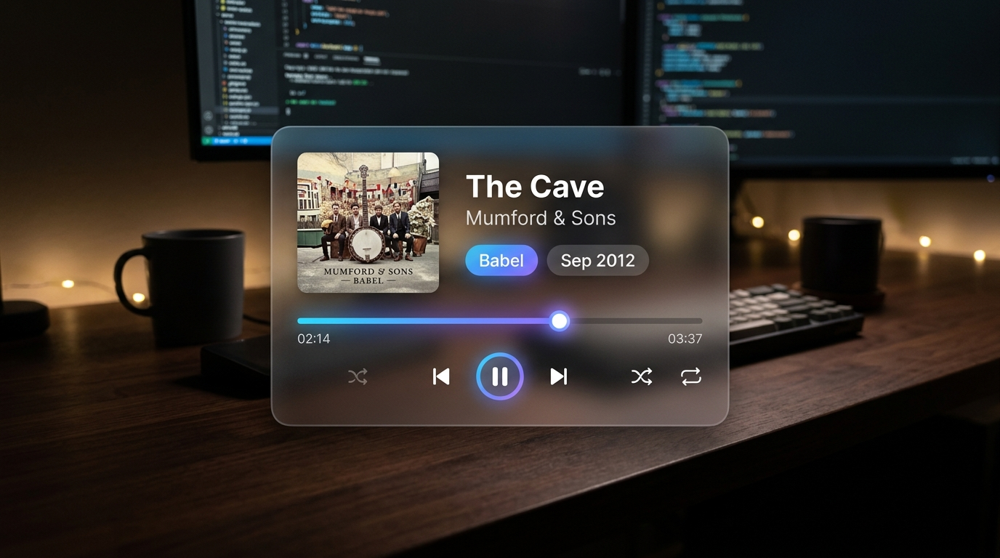

# Folia 增强版悬浮小组件

Folia 0.7.9 桌面音乐小组件，当前版本 1.15.2。

支持海报、胶囊、全功能、纯歌词和 Circuit 五种布局，提供自由排版、歌词翻译、逐词高亮、独立设置窗口、可配置滚轮操作、沉浸模式、未播放时隐藏和整窗切歌播报。

## 安装

将本仓库的 enhanced-remote-widget 文件夹复制到 Folia 的 mods 目录，在模组管理面板启用并确认权限。Windows 的目录为 %APPDATA%\Folia\mods。

[详细说明与权限用途](enhanced-remote-widget/README.md) · [设计说明](enhanced-remote-widget/DESIGN.md)

## 兼容与验证范围

兼容范围限定 Folia 0.7.9。音量功能使用该版本随宿主安装的内部音频状态接口；升级宿主前需重新核对。

1.15.2 为发布前修复包。已进行代码与模拟环境检查，尚未完成真实宿主的多屏、DPI、透明窗口及长期运行验收。预览图为设计示意，不能代表本版实机截图。市场收录需要 Folium 维护者审核与签名。

## 许可证

项目源码采用 [MIT](LICENSE)。随附的 Inter 字体采用 [SIL Open Font License 1.1](enhanced-remote-widget/INTER-LICENSE.txt)。
